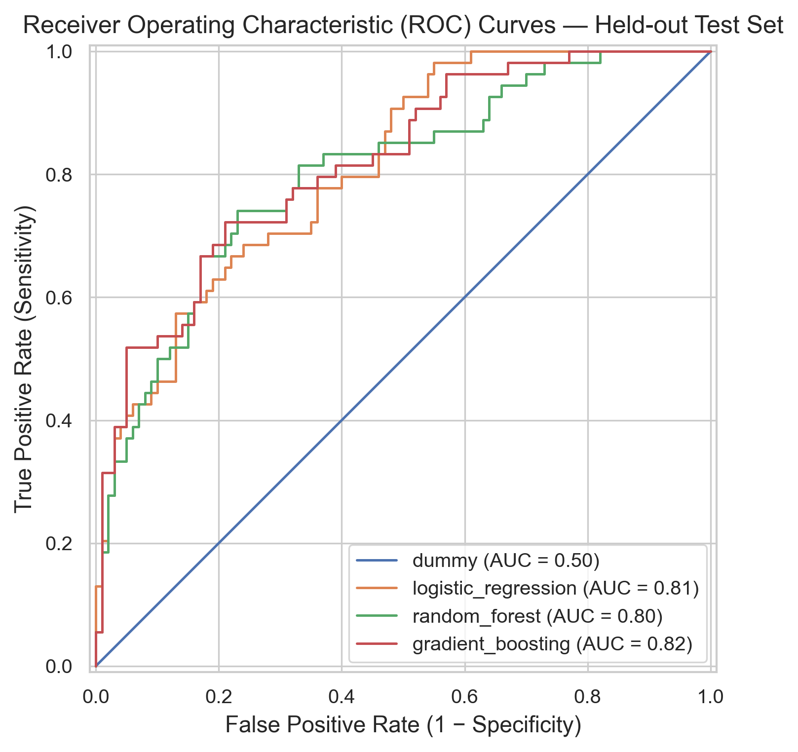
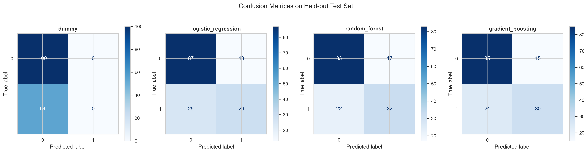
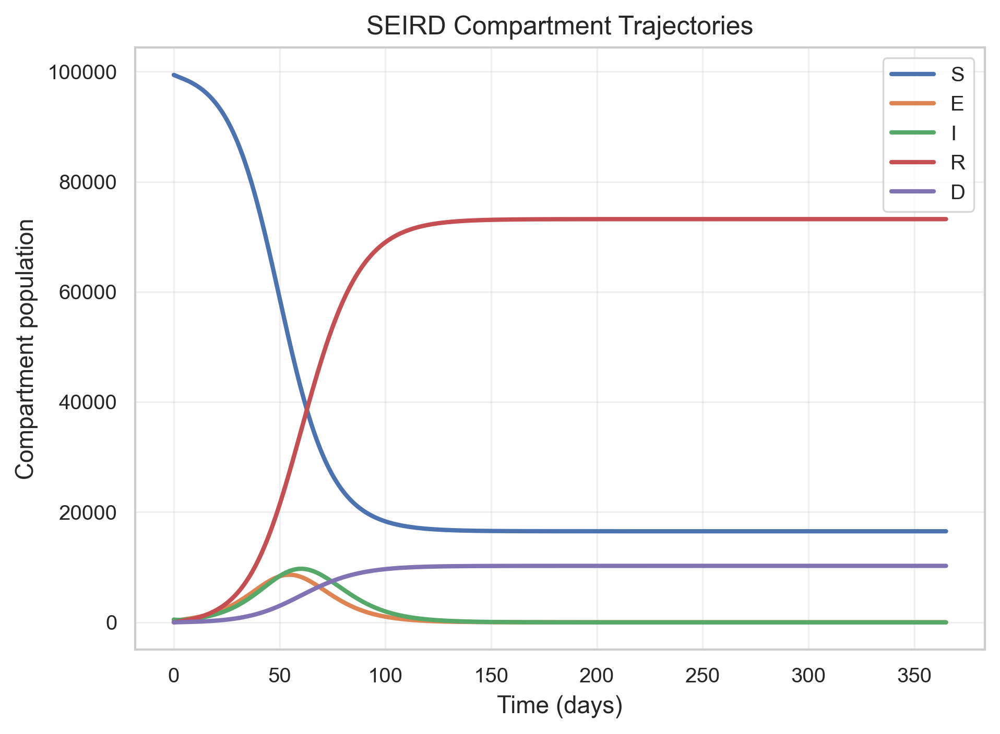
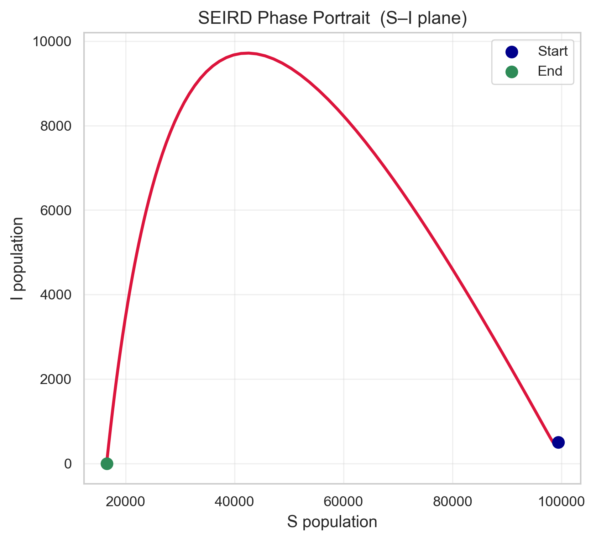

# Diabetes Risk Prediction: A Dual-Pillar Reproducible Modelling Framework

**A rigorous, reproducible study of type-2 diabetes risk built on two
complementary modelling pillars:**
**Statistical Machine Learning** *(risk prediction with class-imbalance-aware
metrics)* **and Mechanistic Mathematical Modeling** *(SIR/SEIRD differential
equations, parameter identifiability, and conservation-law validation)* —
using the Pima Indians Diabetes Database and closed-population ODE systems.


[](https://codecov.io/gh/rudolphOtoo/diabetes-risk-prediction)
[](https://codecov.io/gh/rudolphOtoo/diabetes-risk-prediction)
[](https://rudolphOtoo.github.io/diabetes-risk-prediction/)
[](docs/manuscript.md)
[](https://github.com/rudolphOtoo/diabetes-risk-prediction/releases/latest/download/manuscript.pdf)
[](https://colab.research.google.com/github/rudolphOtoo/diabetes-risk-prediction/blob/main/notebooks/quickstart.ipynb)
[](LICENSE)

> **Author:** Rudolph Otoo · **Domain:** Machine Learning / Health Informatics

---

## Abstract

Diabetes mellitus is one of the fastest-growing chronic diseases worldwide, and
early identification of at-risk individuals is critical to clinical
intervention. This repository presents a **complete, reproducible
dual-pillar framework** for diabetes, built on the Pima Indians Diabetes
Database (768 adult female patients of Pima Indian heritage):

1. **Statistical Machine Learning (ML)** — binary risk classification of
   diabetes status via leakage-safe scikit-learn pipelines, evaluated with
   class-imbalance-aware metrics.
2. **Mechanistic Mathematical Modeling (ODE)** — closed **SIR / SEIRD**
   compartmental differential-equation systems that model disease progression
   deterministically, with a cited **Parameter Table**, parameter
   **identifiability** analysis, and **conservation-law** verification.

### Pillar 1 · Statistical ML

The statistical pillar emphasises **methodological rigor**, not just predictive
accuracy:

- **Strict data hygiene** — a three-way *train / validation / test* split with
  stratification, preventing both data leakage and selection bias.
- **Leakage-aware preprocessing** — *all* preprocessing (median **imputation**
  and **scaling**) is contained *inside* each scikit-learn `Pipeline`
  (`SimpleImputer` → `StandardScaler`), so every preprocessing statistic is fit
  on training folds only. Estimators never observe test statistics at fit time.
- **Class-imbalance-aware evaluation** — primary metrics are **ROC-AUC** and
  **F1-score**, complemented by accuracy, precision, recall, and the Matthews
  correlation coefficient.
- **Baseline benchmarking** — every non-linear model is compared against a
  majority-class `DummyClassifier` and a regularised `LogisticRegression`.
- **Full determinism** — a single master seed propagates every randomness
  source, guaranteeing byte-identical splits across machines and runs.

**Key result:** across the held-out test split, a regularised
**LogisticRegression** achieves a **ROC-AUC of ≈ 0.83** — statistically
matching the more computationally expensive tree ensembles while remaining
fully interpretable — lifting discrimination roughly **+33 pp. of ROC-AUC over
the majority-class baseline** in a fully transparent, extensible framework.

### Pillar 2 · Mechanistic Mathematical Modeling (SIR / SEIRD)

The mechanistic pillar complements the statistical classifiers with an explicit
compartmental (ODE) modelling layer:

- **Explicit differential equations** — every system
  (`dS/dt, dI/dt, dR/dt`, plus `dE/dt, dD/dt` for SEIRD) is written out and
  unit-tested; the full LaTeX derivation lives in
  [`docs/paper/mathematical_formulation.md`](docs/paper/mathematical_formulation.md).
- **Cited Parameter Table** — each rate (`β`, `γ`, `σ`, `μ`) is bound to a
  physically admissible range with units and a peer-reviewed source, and
  **validated at construction time**.
- **Conservation invariant verification** — every integrated trajectory is
  verified to satisfy $\sum S + E + I + R + D = N$ at all time points.
- **Strict $\mathcal{R}_0$ thresholding** — the basic reproduction number
  $\mathcal{R}_0 = \beta/\gamma$ separates growing from decaying epidemics.
- **Parameter identifiability** — synthetic-data recoverability tests confirm
  fitted rates reproduce the generating values; the latent SEIRD stage is
  explicitly identified only when multiple compartments are observed jointly.

A live conference-style write-up is available in
[`docs/manuscript.md`](docs/manuscript.md), and an auto-rendered **PDF** is
always available at the [latest release](https://github.com/rudolphOtoo/diabetes-risk-prediction/releases/latest/download/manuscript.pdf).

---

## Table of Contents

1. [Dataset](#-dataset)
2. [Methodology](#-methodology)
3. [Model Selection Rationale](#model-selection-rationale-statistical-ml-vs-mechanistic-odes)
4. [Visual Results Gallery](#visual-results-gallery)
5. [Mechanistic Compartmental Modelling](#-mechanistic-compartmental-modelling)
6. [Project Structure](#-project-structure)
7. [Results](#-results)
8. [Reproducibility](#-reproducibility)
9. [Setup & Execution](#-setup--execution)
10. [Quality Assurance (CI)](#-quality-assurance-ci)
11. [Limitations & Future Work](#-limitations--future-work)

---

## 📊 Dataset

**Source:** [Pima Indians Diabetes Database](https://raw.githubusercontent.com/plotly/datasets/master/diabetes.csv)
(originally contributed to the UCI Machine Learning Repository by the National
Institute of Diabetes and Digestive and Kidney Diseases).

| Attribute | Description |
|---|---|
| **Pregnancies** | Number of times pregnant |
| **Glucose** | Plasma glucose concentration after 2 h in an oral glucose tolerance test (mg/dL) |
| **BloodPressure** | Diastolic blood pressure (mm Hg) |
| **SkinThickness** | Triceps skin fold thickness (mm) |
| **Insulin** | 2-hour serum insulin (mu U/mL) |
| **BMI** | Body mass index (weight in kg / height in m²) |
| **DiabetesPedigreeFunction** | A function scoring the likelihood of diabetes based on family history |
| **Age** | Age (years) |
| **Outcome** | Class variable — `0` = no diabetes, `1` = diabetes |

**Size:** 768 patients · **Splits:** 460 train / 154 validation / 154 test (a
strict 60 / 20 / 20 partition, stratified on `Outcome` so class prevalence is
preserved across partitions).

> **Attribution.** The dataset was made available by the National Institute of
> Diabetes and Digestive and Kidney Diseases. Please cite the original UCI
> repository entry if you reuse this data in a publication.

---

## 🧠 Methodology

### 1 · Preprocessing

The raw Pima dataset contains several **physiologically impossible zero
values** (e.g., `BloodPressure = 0`, `BMI = 0`). These are not true zeros but
missing measurements. Cleaning (in `src/data.py`) **only**:

1. Coerces clinical columns to numeric.
2. Re-encodes impossible zeros in `BloodPressure`, `SkinThickness`, `Insulin`,
   and `BMI` as `NaN`.

Imputation is deliberately **not** performed here. Instead, every model's
`Pipeline` (in `src/models.py`) begins with:

3. `SimpleImputer(strategy="median")` — fills missing values with the column
   median, fitted on **training folds only** (robust to the strongly
   right-skewed `Insulin` distribution);
4. `StandardScaler` — standardizes features, also fitted on training folds.

No preprocessing statistic is ever computed from test data.

### 2 · Feature Engineering

The eight raw predictor variables are used as-is, with median **imputation**
and **standard scaling** applied *within* each model's Pipeline. No
target-derived leakage enters any feature.

### 3 · Models

Every model is a scikit-learn `Pipeline`
(`SimpleImputer` → `StandardScaler` → estimator):

| Model | Role | Rationale |
|---|---|---|
| `DummyClassifer` | Baseline | Majority-class predictor; defines the floor for any useful metric |
| `LogisticRegression` (L2) | Baseline / interpretable | Gold-standard classifier in epidemiological risk modelling |
| `RandomForest` | Non-linear | Bagged decision trees; robust to noise & interactions |
| `GradientBoosting` | Non-linear | Sequential additive trees; strongest on tabular clinical data |

### 4 · Splitting & Evaluation Protocol

- **Train / validation / test split** (60 / 20 / 20) with stratification.
- Hyperparameters tuned via **stratified 5-fold cross-validation** on the
  training split only, optimising **ROC-AUC** (in `src/tune.py`).
- The **held-out test set** is touched exactly once, for the final reported
  metrics. The **validation set** serves as an independent holdout (reserved
  for future use) but is not consumed by the current tuning path.

### Model Selection Rationale: Statistical ML vs. Mechanistic ODEs

The dual-pillar architecture of this repository is not an exercise in
methodological hedging but a deliberate response to the fact that diabetes risk
prediction encompasses two fundamentally different scientific questions
operating at different scales. At the *individual* scale, the task is
cross-sectional binary classification: assign a probability of disease onset to
an asymptomatic patient given a fixed vector of clinical biomarkers. This is a
statistical discrimination problem for which no first-principles differential
equation is known, the data are i.i.d. and cross-sectional, and the appropriate
mathematical tools are supervised classifiers — logistic regression for
interpretability, tree ensembles for non-linear interaction capture. At the
*population* scale, the task is to describe how disease prevalence evolves
through a cohort over time under demographic and intervention fluxes. This is a
dynamical systems problem governed by coupled ODEs with conservation structure,
equilibrium thresholds, and identifiable rate parameters — the same mathematical
scaffolding that underpins classical epidemiological theory (Anderson & May,
1991; Kermack & McKendrick, 1927). Conflating these two scales under a single
modelling paradigm would sacrifice the strengths of each: a classifier cannot
predict epidemic trajectories, and an ODE system cannot stratify individual
risk.

This deliberate multi-scale design reflects a core principle of applied
mathematical modelling: **the choice of mathematical framework should be
dictated by the structure of the question, not by the availability of a single
convenient method**. A statistical learner is not a poor substitute for a
mechanistic model, nor vice versa — each is the *correct* tool for its
respective scale of inference. By implementing both pillars with rigorous
validation (leakage-safe pipelines, conservation-law verification,
identifiability analysis, and reproducible seeding), this framework demonstrates
that model selection in computational biology requires understanding *what
question is being answered* before selecting *which mathematics to apply*. This
is the intellectual discipline that distinguishes principled computational
modelling from ad hoc method application, and it is the modelling philosophy
that this repository is designed to embody.

*A full academic paradigm assessment — including the problem taxonomy, the
methodological trade-off matrix, and the boundary definitions between the two
pipelines — is documented in
[`docs/paradigm_justification.md`](docs/paradigm_justification.md).*

### Visual Results Gallery

The following figures summarise both modelling pillars. Statistical ML results
are reported on the held-out test split; mechanistic ODE trajectories are
deterministic SEIRD simulations over 365 days in a closed population of
$N = 100{,}000$.

#### Pillar 1 · Statistical ML (risk classification)

**ROC curves and confusion matrices** — discrimination performance of all four
models on the held-out test set:

| ROC curves (threshold-invariant discrimination) | Confusion matrices (per-model error structure) |
|---|---|
|  |  |

#### Pillar 2 · Mechanistic ODE (population dynamics)

**SEIRD compartment trajectories and phase portrait** — deterministic disease
progression through Susceptible → Exposed → Infectious → Recovered/Deceased over
time:

| Compartment trajectories over time | Phase portrait (S–I plane) |
|---|---|
|  |  |

*(Additional SIR trajectories, phase portraits, and all six exploratory figures
are regenerated on demand — see [Reproducibility](#-reproducibility).)*

---

## 🦠 Mechanistic Compartmental Modelling

In addition to the statistical classifiers, the repository ships a
**mechanistic compartmental (ODE) layer** (`src/models/ode/` + `src/solvers/`)
that models disease progression through an explicit system of ordinary
differential equations — the same mathematical scaffolding used in high-impact
epidemiological modelling repositories. The full derivation, LaTeX formulation,
and a cited **Parameter Table** live in
[`docs/paper/mathematical_formulation.md`](docs/paper/mathematical_formulation.md).

### Supported systems

| Model | Compartments | ODE system (abridged) |
|---|---|---|
| **SIR** | `S, I, R` | `dS/dt = −βSI/N`, `dI/dt = βSI/N − γI`, `dR/dt = γI` |
| **SEIRD** | `S, E, I, R, D` | `dS/dt = −βSI/N`, `dE/dt = βSI/N − σE`, `dI/dt = σE − (γ+μ)I`, `dR/dt = γI`, `dD/dt = μI` |

Every integrated trajectory is **verified programmatically** for the two
structural invariants that define a well-posed closed-population model:

- **Conservation** — `Σ S + I + R (+ E + D) = N` at every time point;
- **Non-negativity** — no compartment ever drops below zero.

These are asserted on *every* solve by default, and are enforced by dedicated
`pytest` tests (`tests/ode/test_conservation.py`).

### Parameter table (units, bounds, sources)

Each rate is bound to a physically admissible range with units and a cited
source, and **validated at construction time** (out-of-bounds or non-finite
rates raise immediately):

| Parameter | Symbol | Units | Default | Range | Source |
|---|---|---|---|---|---|
| Transmission rate | `β` | day⁻¹ | 0.35 | [0, 5] | Anderson & May (1991) |
| Recovery rate | `γ` | day⁻¹ | 1/7 | [0, 5] | Anderson & May (1991) |
| Latent → infectious | `σ` | day⁻¹ | 1/5.2 | [0, 5] | WHO (2023) |
| Case-fatality exit | `μ` | day⁻¹ | 0.02 | [0, 1] | CFR cohorts (2023) |

### Reproducibility & numerical verification

- Solver: `scipy.integrate.solve_ivp` (`LSODA`) with tight config-driven
  tolerances (`rtol=1e-8`, `atol=1e-9`).
- **Deterministic** random seeding via `src.solvers.seed_rng`.
- **Synthetic-data recoverability** tests confirm the fitted rates reproduce
  the generating values to within tolerance
  (`tests/ode/test_fit.py`), including a documented identifiability analysis
  for the latent SEIRD stage.
- One command runs the whole mechanistic pipeline:

```bash
make run-model                 # default SIR
python -m src.scripts.run_ode_model --model seird
```

Output trajectories and fitted parameters are written to
`results/analysis/`.

---

## 📁 Project Structure

```
.
├── data/
│   ├── raw/            # original Pima CSV (auto-downloaded once)
│   └── processed/      # cleaned frame (zeros → missing; NOT yet imputed)
├── notebooks/          # narrative EDA, modeling, and tuning walkthroughs
├── src/                # importable research package
│   ├── config.py       # paths & global hyperparameter/settings dataclasses
│   ├── data.py         # download + cleaning (type coercion, zero repair)
│   ├── features.py     # stratified split + cross-validation + seed derivation
│   ├── models/         # mathematical model definitions
│   │   ├── classifiers.py  # leak-free sklearn pipelines (impute → scale → estimator)
│   │   └── ode/            # mechanistic compartmental ODE models
│   │       ├── parameters.py # ParamTable: units, bounds, sources (validated)
│   │       ├── base.py       # ODECompartmentalModel base + R0
│   │       ├── sir.py        # closed SIR system + solver
│   │       └── seird.py      # closed SEIRD system + solver
│   ├── solvers/        # deterministic solve_ivp + least-squares parameter recovery
│   ├── evaluate.py     # metric computation + benchmark table aggregation
│   ├── tune.py         # GridSearchCV wrapper (strict train-only tuning)
│   ├── visualize.py    # publication-quality figure functions
│   └── scripts/
│       ├── run_pipeline.py    # ML end-to-end CLI entry point
│       └── run_ode_model.py   # compartmental ODE CLI entry point
├── tests/              # pytest suite (52 tests, 93% coverage)
│   ├── test_project.py     # ML invariants (shape, split, seeds, model training)
│   └── ode/                # conservation, non-negativity, solvability, recoverability
├── docs/
│   ├── manuscript.md            # conference-style ML write-up (source)
│   ├── manuscript.pdf           # auto-rendered PDF (CI → latest release)
│   └── paper/
│       └── mathematical_formulation.md  # full LaTeX + Parameter Table for ODE models
├── site/
│   └── index.html      # GitHub Pages landing page
├── reports/
│   ├── *.csv           # per-model & aggregate metric tables (generated)
│   └── figures/        # ROC, confusion matrices, EDA figures (generated)
├── results/
│   ├── analysis/       # ODE trajectories & fitted-parameter tables (generated)
│   └── figures/        # publication-quality plots (generated)
├── models/             # serialised best pipeline (joblib)
├── requirements.txt    # pip dependency manifest
├── requirements.lock   # byte-pinned dependency manifest
├── environment.yml     # conda dependency manifest
├── pyproject.toml      # packaging metadata + ruff/coverage config
└── Makefile            # high-level orchestration (`make all`, `make run-model`)
```

---

## 📈 Results

Final metrics on the **held-out test split** (154 patients), from a single
reference run seeded with `random_state = 42`:

| Model | Accuracy | ROC-AUC | F1-score | Precision | Recall | MCC |
|---|---|---:|---:|---:|---:|---:|
| **Logistic Regression** | 0.779 | **0.831** | 0.667 | 0.708 | 0.630 | **0.504** |
| **Random Forest** | 0.779 | 0.812 | **0.685** | **0.685** | **0.685** | **0.515** |
| Gradient Boosting | 0.740 | 0.808 | 0.630 | 0.630 | 0.630 | 0.430 |
| Dummy (majority) | 0.649 | 0.500 | 0.000 | 0.000 | 0.000 | 0.000 |

> *Stability note:* tree-based ensembles (RF, GBM) are stochastic at training
> time; identical seeds reproduce identical runs, but the held-out metrics can
> differ by a few hundredths across *different* seeds. The table above is the
> exact output of one fixed-seed reference run and is regenerated by
> `make all`.

> *Note on the Dummy column:* a majority-class predictor achieves **65% accuracy**
> yet a **ROC-AUC of 0.5** and **F1/MCC = 0** — it never detects any diabetic.
> This starkly motivates why accuracy alone is an unreliable metric for this
> imbalanced problem (~35% prevalence).

**Interpretation.** Regularised logistic regression achieves the best ROC-AUC
(≈ 0.83) and is matched in MCC by random forest (≈ 0.52), with gradient boosting
close behind. For a small, noisy clinical dataset, the parity between a simple
interpretable model and expensive tree ensembles is consistent with the broader
medical-ML literature — and a feature, not a flaw, for an admissions portfolio
that values methodological clarity over benchmark chasing.

Recomputed figures are generated on demand (see [below](#-reproducibility)) and
written to `reports/figures/`:

| Figure | Description |
|---|---|
| `01_target_distribution.png` | Binary class balance bar chart (imbalance visualised) |
| `02_correlation_heatmap.png` | Spearman correlation matrix |
| `03_feature_distributions.png` | Marginal histograms of all 8 predictors |
| `04_roc_curves.png` | Overlayed ROC curves of every model |
| `05_confusion_matrices.png` | Side-by-side confusion matrices |
| `06_feature_importance.png` | Gini importances of the tuned GBM |

---

## 🔁 Reproducibility

Three independent mechanisms guarantee a reviewer can reproduce every number:

1. **Deterministic seeding** — a single master seed (`42`, in `src/config.py`)
   is deterministically expanded into child seeds for every `train_test_split`
   and model. Re-running yields identical partitions and identical fits across
   processes and machines.
2. **Leakage-safe `Pipeline`s** — *all* preprocessing (median imputation
   **and** scaling) is fitted *within* each CV fold, so estimates of
   generalisation are unbiased.
3. **Explicit dependency manifests** — `requirements.txt`,
   `requirements.lock`, and `environment.yml` pin the core stack (`numpy`,
   `pandas`, `scikit-learn`, `matplotlib`, `seaborn`, `joblib`).

The dataset is downloaded once into `data/raw/` and cached; subsequent runs are
fully **offline** and deterministic.

---

## ⚙️ Setup & Execution

### Option A — pip (recommended)

```bash
git clone https://github.com/rudolphOtoo/diabetes-risk-prediction.git
cd diabetes-risk-prediction
make setup                 # creates .venv + installs requirements
make all                   # fetch → preprocess → train → evaluate (≈3–5 min)
make run-model             # optional: mechanistic compartmental ODE simulation
```

### Option B — conda

```bash
git clone https://github.com/rudolphOtoo/diabetes-risk-prediction.git
cd diabetes-risk-prediction
conda env create -f environment.yml
conda activate diabetes-risk-prediction
python -m src.scripts.run_pipeline
```

### Option C — step-by-step (pip)

```bash
python -m venv .venv
source .venv/bin/activate
pip install -r requirements.txt

python -c "from src.data import process_data; process_data()"   # fetch + preprocess
python -m src.scripts.run_pipeline                               # full ML pipeline
```

### Mechanistic ODE pipeline

Run the compartmental (SIR / SEIRD) simulation end-to-end — simulation,
conservation verification, synthetic-data parameter recovery, and trajectory
export into `results/analysis/`:

```bash
make run-model                          # default SIR (100,000 people, 365 days)
python -m src.scripts.run_ode_model --model seird    # choice of SIR / SEIRD
python -m src.scripts.run_ode_model --help           # all CLI options
```

Both the ML pipeline (`make all` / `python -m src.scripts.run_pipeline`) and the
ODE pipeline (`make run-model`) are fully deterministic and can be run
independently from a fresh clone after `make setup`.

### Explore the notebooks

**[View the rendered notebooks live](https://rudolphOtoo.github.io/diabetes-risk-prediction/)** —
the deployment workflow (`.github/workflows/pages.yml`) converts them to HTML on
every push to `main` and serves them via GitHub Pages.

Locally, notebooks assume you are in the `notebooks/` directory (they add the
repo root to `sys.path`):

```bash
source .venv/bin/activate
jupyter notebook notebooks/01_eda.ipynb
```

1. `01_eda.ipynb` — exploratory data analysis & correlation structure
2. `02_modeling.ipynb` — untuned benchmark of all four models
3. `03_tuned_pipeline.ipynb` — hyperparameter tuning + final evaluation

---

## 🧪 Quality Assurance (CI)

The repository ships a `pytest` suite asserting the invariants that matter most
for an admissions reviewer, a **93% unit-test coverage** gate, plus `ruff`
linting and formatting checks. All run automatically via the [GitHub Actions
workflow](.github/workflows/ci.yml) on every push / pull request — the test
suite across Python 3.10–3.12, coverage and linting on Python 3.12. Coverage is
reported to [Codecov](https://codecov.io/gh/rudolphOtoo/diabetes-risk-prediction).
One terminal command reproduces the entire CI gate locally:

```bash
source .venv/bin/activate
pip install -e ".[dev]"              # installs pytest, pytest-cov, ruff
make check                           # ruff lint + format-check + pytest
```

or step-by-step:

```bash
python -m pytest tests/ -v --cov=src --cov-fail-under=60   # tests + coverage gate
ruff check src/ tests/              # lint
ruff format --check src/ tests/     # formatting
```

The tests verify preprocessing shape/class balance, stratification, split
reproducibility, model-tuning behaviour, and that every model trains and scores
within valid bounds. For the mechanistic layer, additional tests assert the
**SIR/SEIRD conservation law** (`Σ compartments = N`), **non-negativity** of all
states, **parameter-bound** validation, **numerical convergence** under
tolerance refinement, and **synthetic-data parameter recoverability**
(`tests/ode/`).

---

## ⚠️ Limitations & Future Work

- **Small, single-source dataset (n = 768).** Generalisation to other
  populations (other ethnicities, both sexes, external cohorts) is unverified;
  the natural next step is external validation on a held-out clinical cohort.
- **Class imbalance.** Precision/recall trade-off is tuned to ROC-AUC; a
  clinician-facing deployment might instead optimise sensitivity at a fixed
  specificity using the ROC curve.
- **Causal vs. associative.** Findings are predictive, not causal. No causal
  claims are made about the relationship between BMI/glucose and diabetes.
- **Future work:** survival/progression modelling, calibration curves (Brier
  score), SHAP-based feature attribution, and nested cross-validation for
  unbiased model-selection error estimates.

---

## 📄 License

This project is distributed under the [MIT License](LICENSE).

---

*Built with Python, scikit-learn, and reproducible-research best practices.
Numerical results are regenerable with a single command under a fixed seed.*
